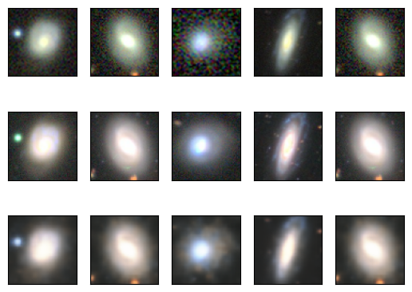

### Upscaling Galaxy Images using Variational Autoencoders (VAEs)

The purpose of this project is to train a VAE with both lower and higher resolution images of galaxies such that it can upscale low quality images of galaxies. An example of this is shown below:

*The first row is the low quality images, the second row is the high quality images, and the third row is the VAE upscaled version of the low quality images.*

The images used as training are contained within the zip files, and all of the code used is contained within `galaxy_vae.ipynb`.